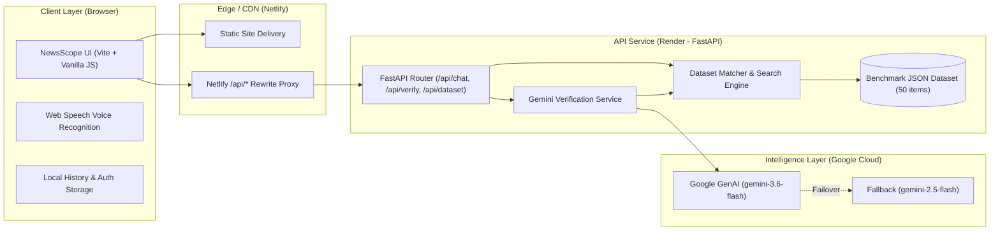

<div align="center">

# 🌐 NewsScope AI
### *Verify News. Detect Bias. Fight Misinformation.*

[](https://newsscope-ai.netlify.app)
[](https://newsscope-backend-zfr6.onrender.com/docs)
[](https://newsscope-backend-zfr6.onrender.com/api/health)
[](https://www.python.org/)
[](https://fastapi.tiangolo.com/)
[](https://ai.google.dev/)
[](https://vitejs.dev/)

<br/>

**NewsScope AI** is a real-time, AI-driven news verification and fact-checking web application powered by **Google Gemini 3.6 Flash**. It empowers users to analyze breaking headlines, political statements, viral social claims, and media articles for factuality, bias, and manipulation.

[Explore Live Web App](https://newsscope-ai.netlify.app) • [View API Documentation](https://newsscope-backend-zfr6.onrender.com/docs) • [Report Issue](https://github.com/anmol11379-web/NewsScope-AI/issues)

</div>

---

## 📌 Table of Contents
- [✨ Key Features](#-key-features)
- [🚀 Live Deployments](#-live-deployments)
- [🏛 Architecture & System Design](#-architecture--system-design)
- [💻 Tech Stack](#-tech-stack)
- [📂 Project Directory Structure](#-project-directory-structure)
- [🛠 Getting Started (Local Setup)](#-getting-started-local-setup)
  - [Prerequisites](#prerequisites)
  - [1. Clone Repository](#1-clone-repository)
  - [2. Backend Configuration](#2-backend-configuration)
  - [3. Frontend Setup](#3-frontend-setup)
- [📡 API Endpoints Reference](#-api-endpoints-reference)
- [📊 Curated Benchmark Dataset](#-curated-benchmark-dataset)
- [⚙️ Environment Variables](#️-environment-variables)
- [🚀 Deployment Guide](#-deployment-guide)
  - [Frontend (Netlify)](#frontend-netlify)
  - [Backend (Render)](#backend-render)
- [🛡 Resiliency & Fallback Strategy](#-resiliency--fallback-strategy)
- [🤝 Contributing](#-contributing)
- [📄 License](#-license)

---

## ✨ Key Features

- 🔍 **Real-Time Fact-Checking Engine**: Instant analysis of headlines, claims, and full article context using Google's state-of-the-art `gemini-3.6-flash` model.
- 🎯 **Credibility Scoring (0–100)**: Quantitative scoring system that categorizes claims into calibrated verdict bands:
  - `Verified & Accurate` (75–100)
  - `Partially Accurate` / `Missing Context` (45–74)
  - `Likely Misleading` / `False & Fabricated` (0–44)
- ⚖️ **Media Bias & Framing Detection**: Surfaces journalistic framing, sensationalism, clickbait, and partisan bias (e.g., *Left/Right-leaning*, *Sensationalist*, *Neutral / Balanced*).
- 📰 **Authoritative Source Attribution**: Pulls reference citations from established wires and databases (e.g., *Reuters*, *Associated Press*, *WHO*, *Nature*, *FactCheck.org*, *Snopes*).
- 🗂 **Curated Benchmark Dataset (50 Ground-Truth Claims)**: Bundled with verified fact-checks spanning Science & Health, Politics & Elections, Technology & AI, and World Affairs.
- 🎙 **Voice Input Integration**: Hands-free news verification using the native browser Web Speech API.
- 💬 **Interactive Chat Interface**: ChatGPT-inspired conversational interface with dynamic card rendering, multi-session chat history, and conversation search.
- 🌓 **Theme Switching & Responsive Design**: Seamless Dark / Light mode switching, mobile drawer navigation, and clean glassmorphic aesthetic.
- 🛡 **Multi-Tiered Fallback Architecture**: Seamless fallback cascade from Gemini 3.6 Flash &rarr; Gemini 2.5 Flash &rarr; Ground-Truth Dataset Match &rarr; Offline heuristic analysis.

---

## 🚀 Live Deployments

| Component | Provider | Live Link | Status |
| :--- | :--- | :--- | :--- |
| **Frontend Web App** | Netlify | [https://newsscope-ai.netlify.app](https://newsscope-ai.netlify.app) |  |
| **Backend API** | Render | [https://newsscope-backend-zfr6.onrender.com](https://newsscope-backend-zfr6.onrender.com) |  |
| **Swagger API Docs** | Render (FastAPI) | [https://newsscope-backend-zfr6.onrender.com/docs](https://newsscope-backend-zfr6.onrender.com/docs) |  |
| **GitHub Repository**| GitHub | [anmol11379-web/NewsScope-AI](https://github.com/anmol11379-web/NewsScope-AI) |  |

---

## 🏛 Architecture & System Design

The application follows a decoupled modern architecture designed for low latency, zero CORS friction in production, and failover resilience:



### Verification Flow
1. **User Submission**: The user enters a headline, statement, or article snippet via text or voice.
2. **Benchmark Pre-Check**: The backend rapidly searches the local ground-truth dataset for semantic and keyword overlap.
3. **LLM Verification**: If verified ground truth exists, it is injected into the context prompt sent to **Google Gemini 3.6 Flash** with strict JSON schema instructions.
4. **Structured Assessment**: The engine returns a structured report including:
   - Numerical Credibility Score (0–100)
   - Badge level & Verdict label
   - Bias & framing identification
   - Executive fact-check summary
   - Key claims and corroborating references
5. **Interactive Visualization**: The frontend parses the JSON response and renders an interactive credibility report card directly in the conversation flow.

---

## 💻 Tech Stack

### Frontend
- **Framework**: Vanilla JavaScript (Modern ES6+ Modules)
- **Styling**: Vanilla CSS3 with Custom Design Tokens (glassmorphism, CSS variables, dark/light themes)
- **Bundler & Dev Server**: [Vite](https://vitejs.dev/)
- **Audio / Voice**: Native Web Speech Recognition API
- **State & Persistence**: `localStorage` (Session history, user profiles, theme preference)

### Backend
- **Framework**: [FastAPI](https://fastapi.tiangolo.com/) (Python 3.10+)
- **Server**: [Uvicorn](https://www.uvicorn.org/) (ASGI high-performance server)
- **AI SDK**: `google-genai` (Official Google GenAI SDK for Gemini)
- **Data Validation**: [Pydantic v2](https://docs.pydantic.dev/)
- **Data Handling**: Pandas & JSON for benchmark dataset queries and indexing

### Deployment & Infrastructure
- **Frontend Hosting**: [Netlify](https://www.netlify.com/) (Automatic builds, CDN, API reverse proxy)
- **Backend Hosting**: [Render](https://render.com/) (Docker / Python Web Service)
- **CORS Handling**: Native FastAPI middleware + Netlify reverse proxy rewrite rules (`/api/*`)

---

## 📂 Project Directory Structure

```plaintext
NewsScope AI/
├── backend/
│   ├── data/
│   │   ├── generate_dataset.py      # Script generating curated benchmark cases
│   │   ├── news_dataset.csv         # Tabular export of verified claims
│   │   └── news_dataset.json        # 50 ground-truth news benchmark items
│   ├── routes/
│   │   ├── __init__.py
│   │   ├── chat.py                  # POST /api/chat endpoint
│   │   ├── dataset.py               # GET /api/dataset endpoints & statistics
│   │   ├── health.py                # GET /api/health monitoring check
│   │   └── verify.py                # POST /api/verify standalone validation
│   ├── services/
│   │   ├── __init__.py
│   │   ├── dataset_service.py       # Search, filtering, and dataset retrieval
│   │   └── gemini_service.py        # Gemini 3.6 prompt engineering & client
│   ├── .env                         # Backend environment variables (ignored)
│   ├── config.py                    # Application config & env loader
│   ├── main.py                      # FastAPI application entry point
│   ├── requirements.txt             # Backend Python dependencies
│   └── run.py                       # CLI execution runner
├── frontend/
│   ├── css/
│   │   ├── animations.css           # Keyframe transitions & entrance animations
│   │   ├── auth.css                 # Login/Signup modal & card styling
│   │   ├── base.css                 # Base resets, typography, and scrollbars
│   │   ├── chat.css                 # Chat layout, message bubbles, analysis cards
│   │   ├── components.css           # Buttons, inputs, modals, tooltips, chips
│   │   ├── layout.css               # Topbar, sidebar, split pane layouts
│   │   └── variables.css            # Dark/Light color tokens & typography vars
│   ├── js/
│   │   ├── app.js                   # Application coordinator & event bindings
│   │   ├── auth.js                  # User authentication & demo session state
│   │   ├── chat.js                  # Chat engine, streaming cards, API requests
│   │   ├── config.js                # Dynamic API baseURL detection
│   │   ├── dataset-modal.js         # Benchmark explorer modal & search logic
│   │   ├── sidebar.js               # Responsive sidebar & conversation history
│   │   ├── storage.js               # Local storage abstraction
│   │   ├── theme.js                 # Theme toggling (Dark / Light mode)
│   │   └── voice.js                 # Voice-to-text audio input controller
│   ├── public/
│   │   ├── _redirects               # Netlify proxy redirects for /api/*
│   │   └── assets/                  # Logos and visual icons
│   ├── index.html                   # Single Page Application HTML markup
│   ├── netlify.toml                 # Frontend Netlify build configuration
│   ├── package.json                 # Frontend dependencies & scripts
│   └── vite.config.js               # Vite config with local backend proxy
├── netlify.toml                     # Root Netlify configuration for workspace
├── package.json                     # Root npm script runner
└── README.md                        # Comprehensive documentation
```

---

## 🛠 Getting Started (Local Setup)

Follow these instructions to run both the frontend and backend services on your local machine.

### Prerequisites
- **Python**: Version `3.10` or higher ([Download Python](https://www.python.org/downloads/))
- **Node.js**: Version `18.x` or higher and `npm` ([Download Node.js](https://nodejs.org/))
- **Google Gemini API Key**: Get a free API key at [Google AI Studio](https://aistudio.google.com/)

---

### 1. Clone Repository

```bash
git clone https://github.com/anmol11379-web/NewsScope-AI.git
cd "NewsScope AI"
```

---

### 2. Backend Configuration

1. Navigate to the `backend` folder:
   ```bash
   cd backend
   ```

2. Create and activate a Python virtual environment:
   - **Windows (PowerShell)**:
     ```powershell
     python -m venv venv
     .\venv\Scripts\Activate.ps1
     ```
   - **macOS / Linux**:
     ```bash
     python3 -m venv venv
     source venv/bin/activate
     ```

3. Install required Python packages:
   ```bash
   pip install -r requirements.txt
   ```

4. Configure your `.env` file inside `backend/.env`:
   ```env
   GEMINI_API_KEY="your_actual_google_gemini_api_key_here"
   MODEL_NAME="gemini-3.6-flash"
   HOST="0.0.0.0"
   PORT="8000"
   DEBUG="true"
   ```

5. Start the FastAPI server:
   ```bash
   uvicorn backend.main:app --reload --host 127.0.0.1 --port 8000
   ```
   *The backend will be live at `http://127.0.0.1:8000` (Interactive docs at `http://127.0.0.1:8000/docs`).*

---

### 3. Frontend Setup

1. Open a new terminal tab and navigate to `frontend`:
   ```bash
   cd frontend
   ```

2. Install dependencies:
   ```bash
   npm install
   ```

3. Start the Vite development server:
   ```bash
   npm run dev
   ```

4. Open your browser at:
   ```text
   http://localhost:3000
   ```
   *Vite is pre-configured to automatically forward any `/api/*` calls directly to `http://127.0.0.1:8000`.*

---

## 📡 API Endpoints Reference

All endpoints return standard JSON responses and are fully documented via Swagger UI at `/docs`.

### 1. Health Check
```http
GET /api/health
```
**Response:**
```json
{
  "status": "healthy",
  "service": "NewsScope AI Backend",
  "model": "gemini-3.6-flash",
  "dataset_items_indexed": 50,
  "api_ready": true
}
```

---

### 2. Chat & News Evaluation
```http
POST /api/chat
Content-Type: application/json
```
**Request Body:**
```json
{
  "message": "Did NASA confirm alien life was found on Mars?",
  "history": [
    { "role": "user", "content": "Hello" },
    { "role": "assistant", "content": "Hello! How can I assist you with news verification today?" }
  ]
}
```
**Response:**
```json
{
  "role": "assistant",
  "content": "I've cross-referenced this claim against NASA announcements and verified astronomical research. Here is the breakdown:",
  "analysis": {
    "title": "Credibility & Fact-Check Report",
    "score": 15,
    "level": "low",
    "verdict": "False & Fabricated",
    "verdictClass": "badge-fake",
    "bias": "Sensationalist / Clickbait",
    "summary": "NASA has never announced confirmation of alien life on Mars. While rovers like Perseverance analyze biosignature candidates, no definitive evidence exists.",
    "sources": [
      "NASA Astrobiology Division — Official Mission Records",
      "Reuters Fact Check — Clarification on rover findings",
      "Associated Press — Debunking viral space rumors"
    ],
    "key_claims": [
      "No confirmation of extraterrestrial organisms on Mars has been issued by NASA."
    ]
  }
}
```

---

### 3. Standalone Claim Verification
```http
POST /api/verify
Content-Type: application/json
```
**Request Body:**
```json
{
  "claim": "WHO declares mpox public health emergency of international concern",
  "context": "Declared in August 2024 following outbreak surges across Central Africa."
}
```

---

### 4. Benchmark Dataset Endpoints
- `GET /api/dataset` — List benchmark claims (supports `?category=`, `?q=`, `?limit=`, `?offset=`)
- `GET /api/dataset/stats` — Summary metrics (category counts, verdict ratios, average credibility score)
- `GET /api/dataset/random` — Fetch a random ground-truth sample for quick testing
- `GET /api/dataset/{item_id}` — Retrieve a specific item by ID (e.g. `NEWS-001`)

---

## 📊 Curated Benchmark Dataset

The system includes a 50-item curated news benchmark dataset (`backend/data/news_dataset.json` & `.csv`) covering:

| Category | Example Topics | Typical Verdicts |
| :--- | :--- | :--- |
| **Science & Health** | Vaccine efficacy, NASA/JWST findings, WHO declarations, mpox, climate reports | Verified, Partially Accurate, Misleading |
| **Politics & Elections** | Voting laws, election audits, supreme court decisions, policy statements | Verified, Disputed, Partisan Framing |
| **Technology & AI** | AI copyright rules, chip bans, deepfake detections, quantum computing claims | Verified, Speculative, Misleading |
| **World Affairs & Economy** | Global treaties, inflation indicators, geopolitical summits, disaster reports | Verified, Missing Context, False Hoaxes |

Each item contains ground-truth:
- Headline & Specific Claim
- Official Fact-Checker Attribution (*Reuters*, *AP*, *Snopes*, *FactCheck.org*)
- Ground-Truth Credibility Score (0–100) & Verdict Class
- Primary Verification Sources & Detailed Debunking / Corroborating Analysis
- Topical Search Tags

---

## ⚙️ Environment Variables

### Backend (`backend/.env`)
| Variable | Required | Default | Description |
| :--- | :---: | :---: | :--- |
| `GEMINI_API_KEY` | **Yes** | — | Google Gemini API key from Google AI Studio |
| `MODEL_NAME` | No | `gemini-3.6-flash` | Primary Gemini model ID |
| `HOST` | No | `0.0.0.0` | Bind host for FastAPI server |
| `PORT` | No | `8000` | Port for backend service |
| `DEBUG` | No | `true` | Enables FastAPI debug logs and reload |

### Frontend (`frontend/.env` or Netlify Environment)
| Variable | Required | Default | Description |
| :--- | :---: | :---: | :--- |
| `VITE_API_URL` | No | `""` *(uses `/api` proxy)* | Explicit backend base URL if not using Netlify proxy |

---

## 🚀 Deployment Guide

### Frontend (Netlify)
1. Link your GitHub repository in the **Netlify Dashboard**.
2. Configure build settings:
   - **Base directory**: `frontend`
   - **Build command**: `npm run build`
   - **Publish directory**: `dist`
3. Netlify will detect `netlify.toml` and redirect `/api/*` queries directly to your Render backend without exposing backend ports or causing cross-origin issues.

### Backend (Render)
1. Create a new **Web Service** on [Render](https://render.com/) pointing to your repository.
2. Configure service parameters:
   - **Runtime**: `Python 3`
   - **Root Directory**: `backend` (or run with full package path from root)
   - **Build Command**: `pip install -r requirements.txt`
   - **Start Command**: `uvicorn backend.main:app --host 0.0.0.0 --port $PORT`
3. Add Environment Variable:
   - `GEMINI_API_KEY` = `<your-api-key>`
   - `MODEL_NAME` = `gemini-3.6-flash`

---

## 🛡 Resiliency & Fallback Strategy

NewsScope AI is engineered to guarantee uptime and meaningful feedback even during network constraints or API rate limits:

```
[User Query]
    │
    ▼
[Local Dataset Search] ──(Ground-truth match found)──► Injected as ground truth context
    │
    ▼
[Google Gemini 3.6 Flash] ──(Success)───────────────► High-precision structured report
    │
    ├──(Rate limit / 503 / Failure)
    ▼
[Google Gemini 2.5 Flash] ──(Success)───────────────► Backup model response
    │
    ├──(Complete offline / Network timeout)
    ▼
[Ground-Truth Benchmark Fallback] ──────────────────► Verified database fact-check
    │
    ├──(Unmatched query & offline)
    ▼
[Smart Heuristic Response] ─────────────────────────► Graceful status guidance
```

---

## 🤝 Contributing

Contributions, issues, and feature requests are welcome!
1. Fork the Project
2. Create your Feature Branch (`git checkout -b feature/AmazingFeature`)
3. Commit your Changes (`git commit -m 'Add some AmazingFeature'`)
4. Push to the Branch (`git push origin feature/AmazingFeature`)
5. Open a Pull Request

---

## 📄 License

This project is licensed under the **MIT License** — feel free to use and adapt this project for research and educational purposes.

<div align="center">

**Built with ❤️ to fight misinformation and promote digital media literacy.**

[Back to Top ⬆](#-newsscope-ai)

</div>
